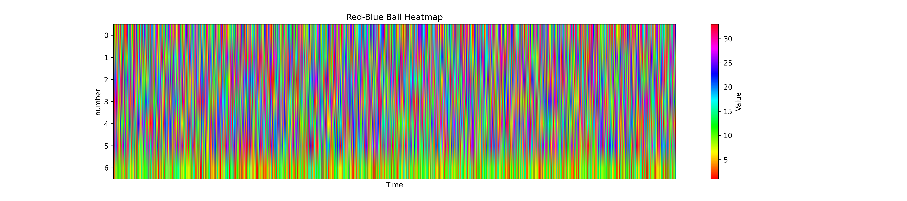

# MoneyCat
考虑到人工干预、机械磨损等因素，我们坚信双色球数据是一个近似混沌（数据不具备唯一性）的数据而并不绝对随机。     
“广义混沌同步”告诉我们混沌数据可以被短期预测，而不可以被长期预测。因此，我们可采用混沌/现代神经网络对其进行数据的短期预测。

# 数据分布


# 安装依赖
```bash
conda create -n torch_env python=3.12 
conda activate torch_env
pip3 install -r requirements.txt
```

# 使用
1. 获取数据并解析
```bash
python3 0_acquire_data.py
```

2. 数据预测
```bash
python3 convtrans_prediction.py
```